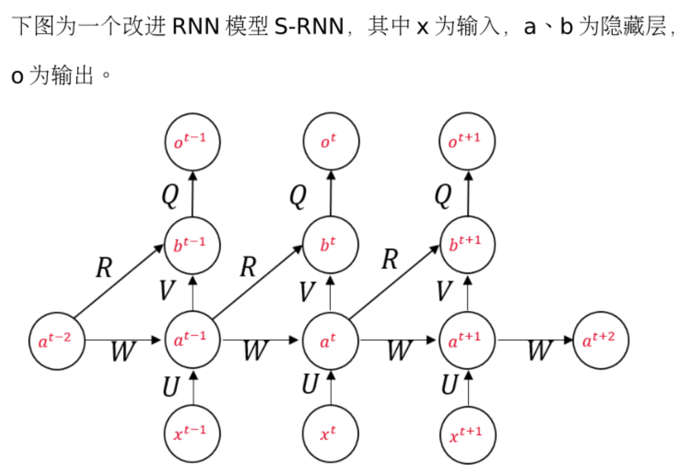
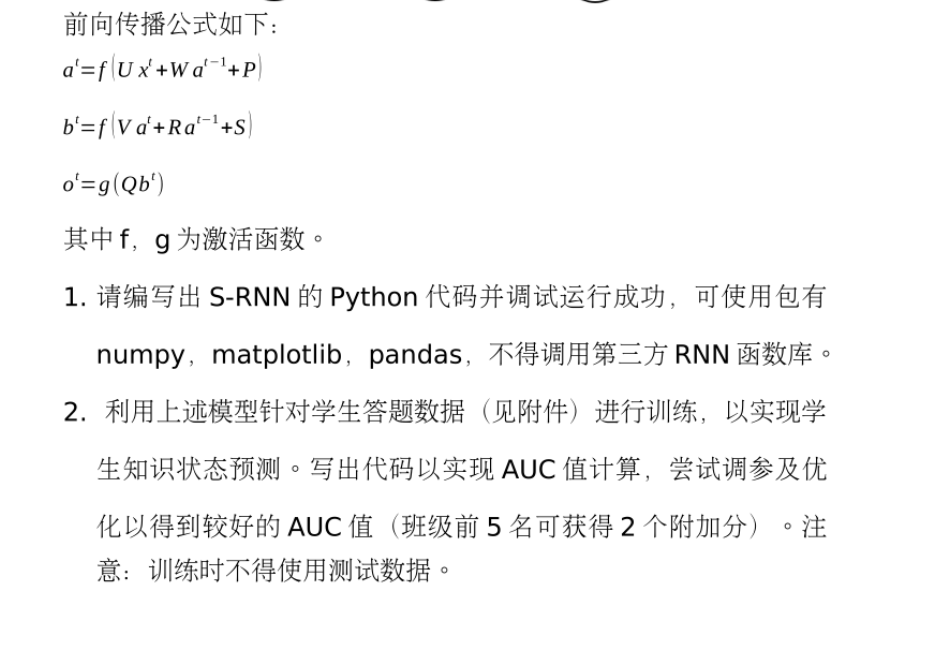

* [S\-RNN\-only numpy](#s-rnn-only-numpy)
* [问题描述](#问题描述)
* [主要参考](#主要参考)
* [存在问题](#存在问题)
* [注](#注)

# S-RNN-only numpy

此项目为苏伟作业

# 问题描述

# 主要参考

1. [股票预测](https://github.com/Tongjilibo/rnn_numpy_stock)
2. [原始文献及代码](https://github.com/chrispiech/DeepKnowledgeTracing)
3. [知识追踪](https://github.com/YAO0747/study/tree/master/DKT)
4. [输入输出介绍](https://zhuanlan.zhihu.com/p/395577413)

除了这些之外，中间尝试了许多似有用但没用的，踩坑

# 存在问题

很容易梯度爆炸，百度方法是梯度裁剪，但是一时间很难确定裁剪的范围，因为参数太大了，而且就算裁剪也得在调试啥的时间来不及

# 注

不保证反向传播过程正确性
